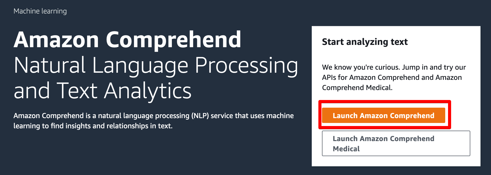
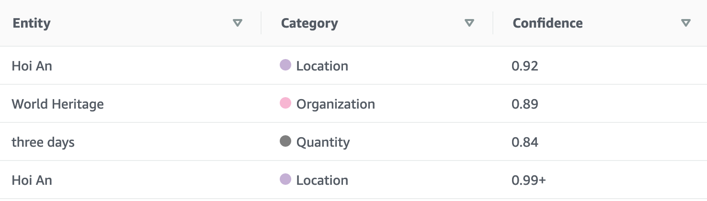
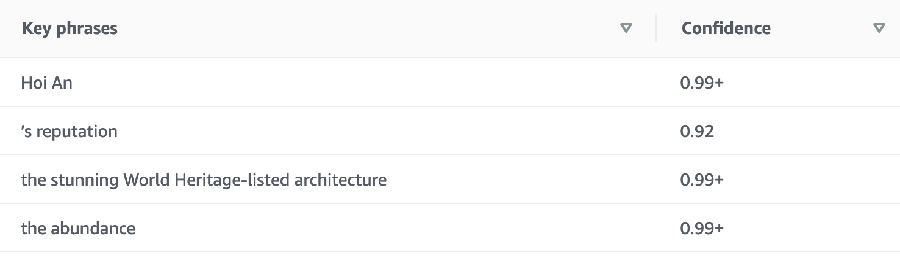
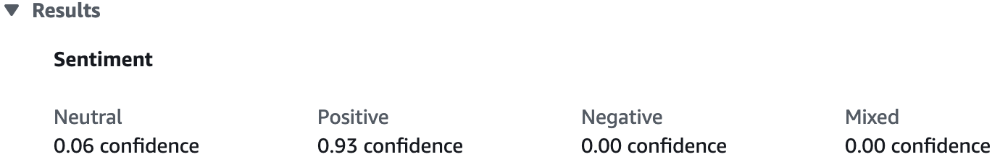
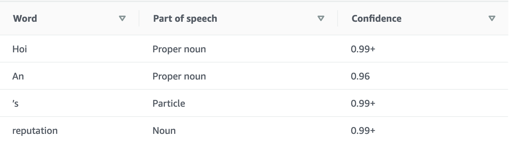
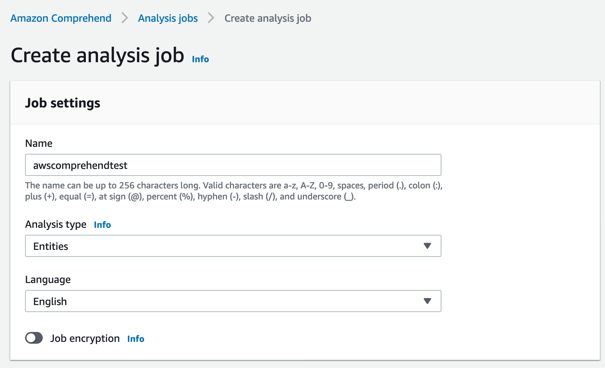
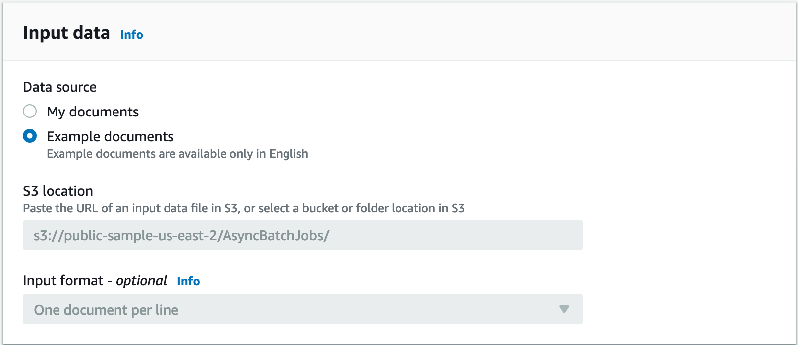
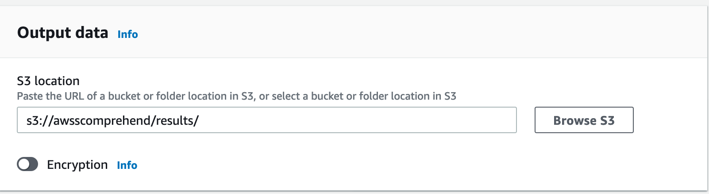
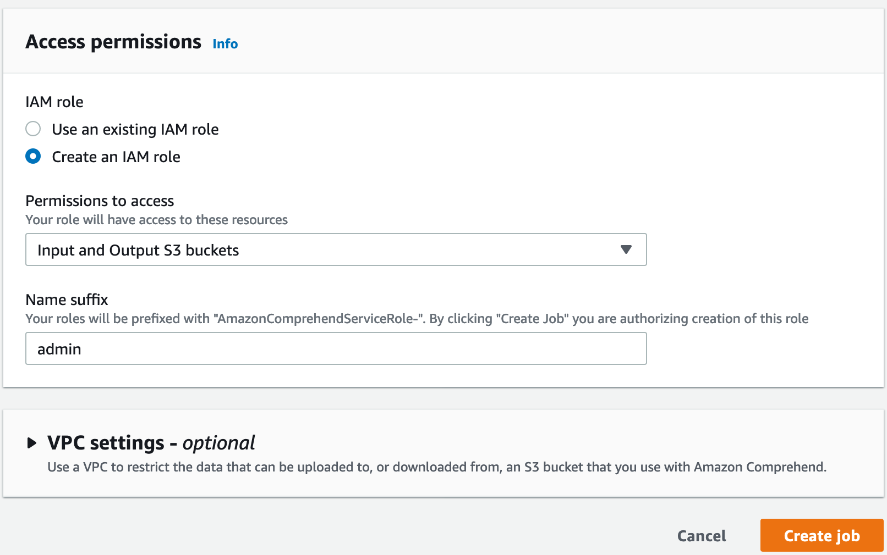
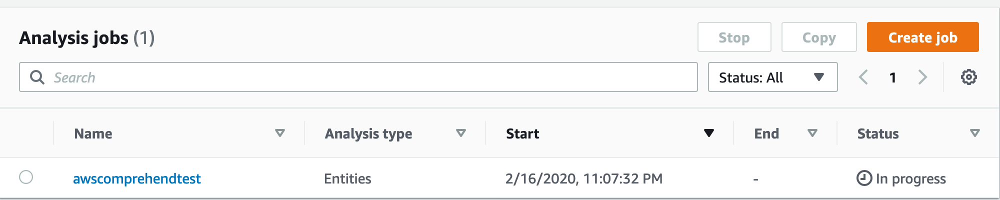

# Amazon Comprehend on AWS sp20-516-227 Xin Gu

:o2: reject - does not pass markdown syntax

## Introduction

Amazon Comprehensive does the analysis of text materials by Natural Language Processing (NLP) and draws insights by identifying domain languages, entities, key phrases, sentiment, syntax, and topic modeling. On Amazon comprehend console, it can process up to 1000 words at a time, while batch text analysis can take in documents saved in AWS S3 buckets. Users can also choose to use AWS Command Line Interface (CLI) or SDKs for different programming languages to interact with Amazon Comprehend server directly, get real-time analysis results or return results into AWS S3 buckets. Amazon Comprehensive can train customized classifiers, then use the trained model to analyze test data. Customized classifiers can best perform and give insights based on customer's specialty and interests [@227comprehendf]. @fig:227AWSComprehend shows the workflow of Amazon Comprehend [@227comprehendmech].

Amazon Comprehend medical is good at dealing with unstructured medical records. Amazon Comprehend Medical is specific for better extracting information from medical notes or reports. It can accurately draw information from complex and various types of medical terms, such as dosages, strengths, frequencies, and medications. Amazon Comprehend Medical can connect related medicines with dosages, strengths, and frequencies, which for example, will help reduce the time for an analyst to find the best patient candidates to perform clinical study [@227AWSComMed].

```markdown
![Amazon Comprehend Working Mechanism  [@227comprehendmech]](images/227AWSComprehend.png){#fig:227AWSComprehend}
```

When other Amazon AI services work with Amazon Comprehend together, the AI solution will enhance business operation, supervision, and managing. For example, with Amazon Comprehend as one of the critical compartments, Amazon Connect [@227AWSComConn] AI solution can provide more natural, dynamic, and efficient customer services through analyzing voice and chat, the architecture is shown in @fig:227AWSComConn [@227AWSComConnA]. 

```markdown
![AI Powered Speech Analytics for Amazon Connect Architecture  [@227AWSComConnA]](images/227AWSComConn.png){#fig:227AWSComConn}
```

* Amazon Comprehend Features

    * Keyphrase Extraction
    * Sentiment Analysis
    * Syntax Analysis
    * Entity Recognition
    * Comprehend Medical
        - Medical Named Entity and Relationship Extraction (NERe)
        - Medical Ontology Linking
    * Custom Entities
    * Language Detection
        - Amazon Comprehend could detect 100 different kinds of languages. The output is about the domain language with an amazon confidence score.
    * Custom Classification
    * Topic Modeling: 
        - Topic modeling organizes documents based on the identified topics, map documents into feature groups. 
    * Multiple language support
        - 12 languages, including German, Italian, Japanese, Arabic, English, Portuguese, Korean, Chinese (simplified), Spanish, French, Hindi, and Chinese (traditional), can not only be detected as domain languages but also good for other features.

* Amazon Comprehend Pricing

The machine learning model was pre-trained; users do not need to know how to do machine learning, train their model, nor deploy it. AWS fully manages the service, and users only pay for what they used base on the amount of text. 

For NLP detecting default features, pricing is shown in @fig:227AWSComPri [@277comprehendpricing].

```markdown
![Pricing for Natural Language Processing  [@277comprehendpricing]](images/227AWSComPri.png){#fig:227AWSComPri}
```

For Topic Modeling, the first 100 MB is charged at a flat rate of $1.00 per job. $0.004 per MB after 100 MB.

For Custom Comprehend, the total price includes the cost for processing characters in the custom model, model training, and model management.
```markdown
    Cost for processing characters:
    
        * Asynchronous classification: $0.0005 per unit
        
        * Synchronous classification: $0.0005 per second
        
    Cost for model training: $3 per hour
    
    Cost for model management: $0.50 per month
```

The Amazon Comprehensive free tier is available for AWS customers for 12 months, starting from the time requiring the Amazon Comprehensive service [@277comprehendpricing].

## Amazon Comprehend Console

### Login to Amazon Comprehend Console

Log in to your Amazon AWS account, search for "comprehend", open the [web page] (https://console.aws.amazon.com/comprehend/home?region=us-east-1#welcome) for Amazon Comprehend, click "Launch Amazon comprehend", shown in @fig:227AWSComLogin. 

```markdown
{#fig:227AWSComLogin}
```

### Analysis with Amazon Comprehend Console

In Amazon Comprehend Console, you can analyze text with up to 1000 words, which is suitable for real-time analysis. Click "Analyze" to run an analyze of the text.

Insights section has five features, including Entities, Key phrases, Language, Sentiment, and Syntax. Click on each tab to see the results.

Take a short paragraph from an article online [@227Verhoeven2020Feb] about traveling in Vietnam as an example. 

@fig:227AWSComEnti shows the part of the result of entities. The result table shows identified words, categories confidence scores in each column. The higher the confidence score (up to 1), the more confident the results. For this example, Amazon Comprehend successfully identified Vietnamese location names.

```markdown
{#fig:227AWSComEnti}
```

@fig:227AWSComKey shows the Key phrases identified by Amazon comprehend.

```markdown
{#fig:227AWSComKey}
```

@fig:227AWSComSen shows the sentiment of positive with 0.93 confidence. 

```markdown
{#fig:227AWSComSen}
```

@fig:227AWSComSyn shows the syntax of the text. There are three fields, Word, Part of speech, and Confidence.

```markdown
{#fig:227AWSComSyn}
```

### Batch Analysis with Amazon Comprehend Analysis Jobs

Analysis Jobs will let you pull data from AWS S3 buckets and return results in an AWS bucket. It is convenient when you have batches of data with more than 1000 words.

#### Create an Analysis Job

First, enter the name of the job, choose the analysis type as you like (including build-in types and custom type), and choose the language, shown in @fig:227AWSComAJ1. 

```markdown
{#fig:227AWSComAJ1}
```

For a demo, choose "Example documents". If you choose "My documents", specify the S3 bucket location and optional input format, shown in @fig:227AWSComAJ2. 

```markdown
{#fig:227AWSComAJ2}
```

Specify the location of S3 bucket for output data, shown in @fig:227AWSComAJ3. 

```markdown
{#fig:227AWSComAJ3}
```

Choose the IAM role, Permission to access, and Name suffix, shown in @fig:227AWSComAJ4.

```markdown
{#fig:227AWSComAJ4} 
```

Click "Create Job". Then the job and status will show as in @fig:227AWSComAJ5. After the completion of the job, "job status" will become "Completed".

```markdown
{#fig:227AWSComAJ5}
```

#### Download the result

Click the name of the analysis job, it will show the detail about it, including the input and output location. Go to the S3 buckets, download the output.tar.gz file, unzip the .gz file and open by Text Editor. Every identified entity was stored in an dictionary in json format, shown as follows:

```markdown
    {"Entities": [{"BeginOffset": 102, "EndOffset": 106, "Score": 0.5592554561638537, "Text": "some", "Type": "QUANTITY"}, {"BeginOffset": 151, "EndOffset": 164, "Score": 0.7462535507655865, "Text": "Ancient Greek", "Type": "OTHER"}, {"BeginOffset": 481, "EndOffset": 494, "Score": 0.9061201846423403, "Text": "Ancient Greek", "Type": "OTHER"}], "File": "Sample.txt", "Line": 1}
```
 
## Amazon Comprehend API
 
* Amazon Command Line Interface (AWS CLI)

    Please refer to [Cloud Computing](https://laszewski.github.io/book/cloud/), 9.2.4 AWS Command Line Interface.

    To get more information about installing Amazon CLI, please see the [link](https://docs.aws.amazon.com/cli/latest/userguide/install-cliv2.html).
    
* AWS SDK for Python (Boto)

    Please refer to [Cloud Computing](https://laszewski.github.io/book/cloud/), 9.2.11 Boto.
        
* Other SDKs for different programming languages

        * AWS SDK for Java
        * AWS SDK for .NET
        * AWS SDK for JavaScript
        * AWS SDK for PHP
        * AWS SDK for Ruby
        * AWS SDK for Go 
        
### AWS CLI examples for Amazon Comprehend

* Detecting Entities

```markdown
    DESCRIPTION
           Inspects text for named entities and returns information about them.
    
    aws comprehend detect-entities
                      --text
                      --language-code
                      [--cli-input-json | --cli-input-yaml]
                      [--generate-cli-skeleton]
                      [--cli-auto-prompt]
```
         
Example:

*Note: results will be more accurate if provided more text. Here, we will only use one sentence for a showcase.*

```markdown
    aws comprehend detect-entities --language-code "en" --text "Hoi An's reputation precedes it — from the stunning World Heritage-listed architecture to the abundance of quality tailors."
```

Output:

```markdown
    {
        "Entities": [
            {
                "Score": 0.9669461250305176,
                "Type": "PERSON",
                "Text": "Hoi An",
                "BeginOffset": 0,
                "EndOffset": 6
            },
            {
                "Score": 0.9146572351455688,
                "Type": "ORGANIZATION",
                "Text": "World Heritage",
                "BeginOffset": 52,
                "EndOffset": 66
            }
        ]
    }
```

* Detecting Key Phrases

```markdown
    DESCRIPTION
           Detects the key noun phrases found in the text.
    
    aws comprehend detect-key-phrases
                      --text 
                      --language-code 
                      [--cli-input-json | --cli-input-yaml]
                      [--generate-cli-skeleton]
                      [--cli-auto-prompt]
```

*Detecting Language

```markdown
    DESCRIPTION
           Determines  the dominant language of the input text.
    
    aws comprehend detect-dominant-language
                      --text
                      [--cli-input-json | --cli-input-yaml]
                      [--generate-cli-skeleton]
                      [--cli-auto-prompt]
```

* Detecting Sentiment

```markdown
    DESCRIPTION
           Inspects  text  and  returns  an  inference of the prevailing sentiment
           (POSITIVE , NEUTRAL , MIXED , or NEGATIVE ).
    
    aws comprehend detect-sentiment
                      --text
                      --language-code
                      [--cli-input-json | --cli-input-yaml]
                      [--generate-cli-skeleton]
                      [--cli-auto-prompt]
```
    
* Detecting Syntax

```markdown
    DESCRIPTION
           Inspects text for syntax and the part of speech of words in the document.
    
    aws comprehend detect-syntax
                      --text
                      --language-code
                      [--cli-input-json | --cli-input-yaml]
                      [--generate-cli-skeleton]
                      [--cli-auto-prompt]
```        

### Batch processing with AWS CLI

Batch processing could take up to 25 documents and significantly improve working efficiency. 

```markdown
    aws comprehend batch-detect-entities
                      --text-list
                      --language-code
                      [--cli-input-json | --cli-input-yaml]
                      [--generate-cli-skeleton]
                      [--cli-auto-prompt]
```  

Similarly, there are other commands for batch detecting key-phrases, dominant-language, sentiment, and syntax.

*Note: If you get HTTP code of 200, it means the text analysis is successfully processed.*


## Custom Classification

Amazon Comprehend offers users to train their unique text analysis NLP models with AWS sequence tagging deep neural network model [@227AWSComM]. When preparing custom classification, choose between multi-class and multi-label modes. Multi-class mode specifies a single class for every document; classes are exclusive. A custom classifier trained with multi-class mode could be used for real-time analysis and batch analysis. Multi-label mode specifies one or more classes for every document. A custom classifier trained with multi-label mode could only be used for batch analysis.

For more information, please refer to [Link](https://aws.amazon.com/comprehend/resources).

### Applications

* Use Amazon comprehend to analyze through communication documents and discover underlining factors for the satisfaction of services.

* Use Amazon comprehend to assist search efficiency.

* Organize documents by topics and build a recommendation system for readers.

* Help customer service to identify relevant information quickly, give documented solutions and guidance for customer service staff.

* Amazon Comprehend medical is specialized in handling unstructured medical records. It will help to organize and searching medical records efficiently.

    _Here is an introduction about processing unstructured medical data using Amazon Comprehend Medical, [Link](https://vimeo.com/333817612)_.


