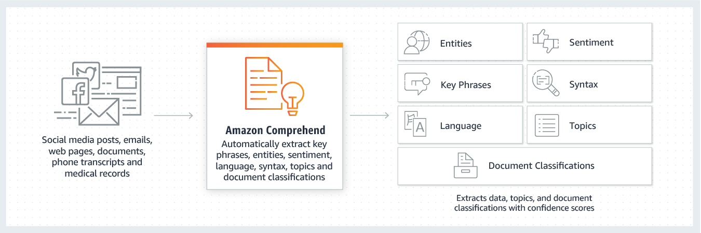
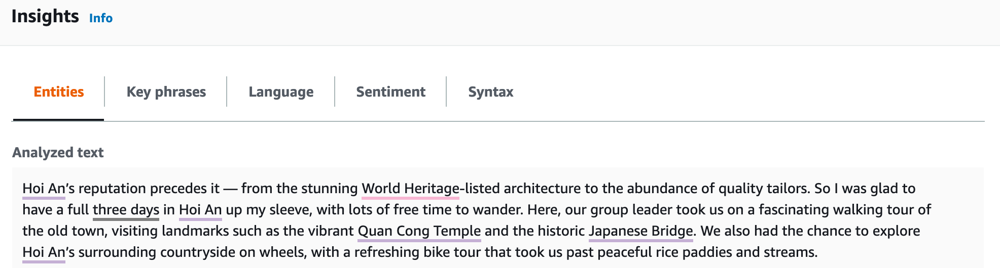
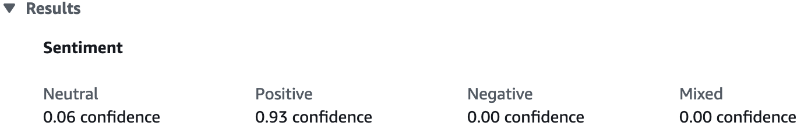
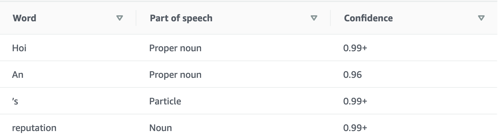
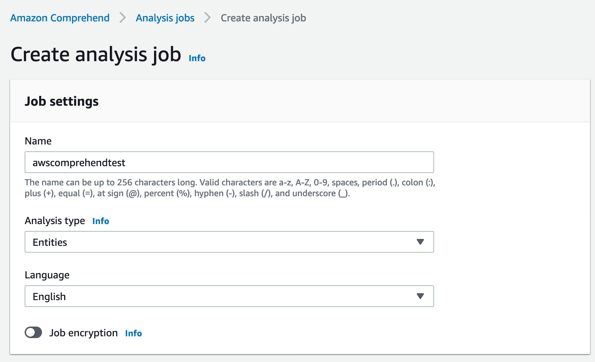
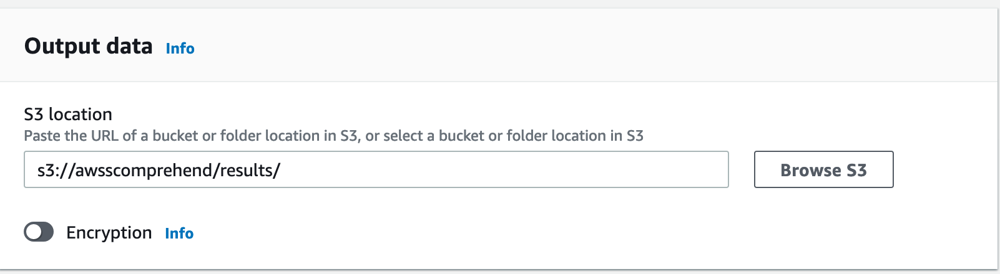
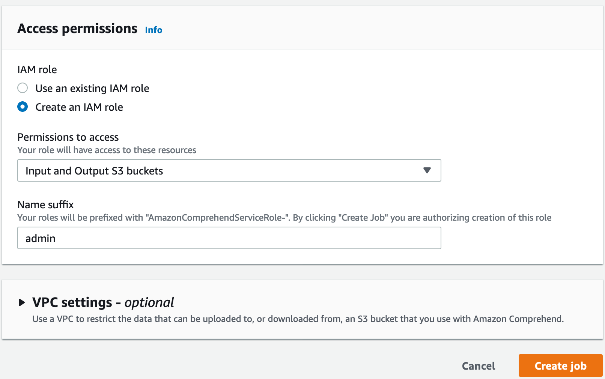
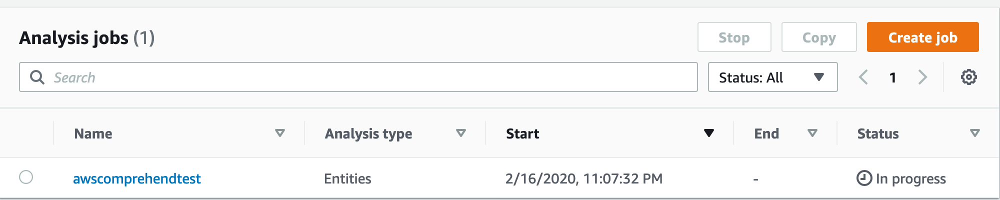

# Amazon Comprehend on AWS sp20-516-227 Xin Gu

### Intro

Amazon Comprehensive gives insights based on analyzing text materials by Natural Language Processing (NLP). It could identify the languages, entities, make relations with terms or topics, detect the sentiment. Amazon Comprehensive can be customized to find specific words or phrases of interests, such as membership, cancellation or part codes [@227comprehendf]. 

@fig:AWScomprehend shows the workflow of Amazon Comprehend. 

{#fig:AWScomprehend}

Amazon Comprehend Medical is specific for better extracting information from medical notes or reports. It can accurately draw information from complex and various types of medical terms, such as dosages, strengths, frequencies, and medications. Amazon Comprehend Medical can connect related medications with dosages, strengths, and frequencies.

> Features

    * Keyphrase Extraction
    * Sentiment Analysis
    * Syntax Analysis
    * Entity Recognition
    * Comprehend Medical
        - Medical Named Entity and Relationship Extraction (NERe)
        - Medical Ontology Linking
    * Custom Entities
    * Language Detection
        - Amazon Comprehend chould detect 100 different kinds of languages. The output is about the domain language with a amazon confidence score.
    * Custom Classification
    * Topic Modeling
    * Multiple language support
        - Other than detect domine languge, More features are offered for 12 languages, including German, Italian, Japanese, Arabic, English, Portuguese, Korean, Chinese (simplified), Spanish, French, Hindi, and Chinese (traditional).

> Pricing

The machine learning model was pre-trained; users do not need to know how to do machine learning, train their model, nor deploy it. AWS fully manages the service, and users only pay for what they used base on the amount of text. 

The Amazon Comprehensive free tier is available for AWS customers for 12 months, starting from the time requiring the Amazon Comprehensive service [@277comprehendpricing].

#### Amazon Comprehend Console

##### Login to Amazon Comprehend Console

Login to your Amazon AWS account, search for "comprehend", open the web page <https://console.aws.amazon.com/comprehend/home?region=us-east-1#welcome> for Amazon Comprehend, click "Launch Amazon comprehend", shown in @fig:227AWSComLogin. 

{#fig:227AWSComLogin}

##### Analysis with Amazon Comprehend Console

In Amazon Comprehend Console, you can analyze text with up to 1000 words, which is good for real-time analysis. Click "Analyze" to run an analyze of the text.

Insights section has 5 features, including Entities, Key phrases, Language, Sentiment, and Syntax. click on each tab to see the results.

Take a short paragraph from an article online [@Verhoeven2020Feb] about traveling in Vietnam as an example. 

@fig:227AWSComEnti shows the part of the result of entities. The result table shows identified words, categories confidence scores in each column. For this example, AWS comprehend successfully identified Vietnamese location names.


{#fig:227AWSComEnti}

@fig:227AWSComKey shows the Key phrases identified by AWS comprehend.

{#fig:227AWSComKey}

@fig:227AWSComSen shows the sentiment of positive with 0.93 confidence. 

{#fig:227AWSComSen}

@fig:227AWSComSyn shows the syntax of the text. There are three fields, Word, Part of speech and Confidence.

{#fig:227AWSComSyn}

##### Analysis with Amazon Comprehend Analysis Jobs

Analisis Jobs will let you pull data from AWS S3 buckets and return results in an AWS buckets. It is convenient when you have batches of data with more than 1000 words.

> Create a Analysis Job

First, enter the name of the job, choose the analysis type as you like (including: build-in types and custom type) and choose the language, shown in @fig:227AWSComAJ1. 

{#fig:227AWSComAJ1}

For demo popurse, choose "Example documents". If choose "My documents", specify the S3 bucket location and optional input format, shown in @fig:227AWSComAJ2. 

{#fig:227AWSComAJ2}

Specify the location of S3 bucket for output data, shown in @fig:227AWSComAJ3. 

{#fig:227AWSComAJ3}

Choose the IAM role, Permission to access, and Name suffix, shown in @fig:227AWSComAJ4.

{#fig:227AWSComAJ4} 

Click "Create Job". Then the job and status will show as in @fig:227AWSComAJ5. After the completion of the job, job status will become "Completed".

{#fig:227AWSComAJ5}

> Download the result

Click the name of the analysis job, it will show the detail about it, including the input and output locatation. Go to the S3 buckets, download the output.tar.gz file, unzip the .gz file and open by Text Editor. Every identified entity was stored in an nested dictionary, shown as follows:

```bash
{"Entities": [{"BeginOffset": 102, "EndOffset": 106, "Score": 0.5592554561638537, "Text": "some", "Type": "QUANTITY"}, {"BeginOffset": 151, "EndOffset": 164, "Score": 0.7462535507655865, "Text": "Ancient Greek", "Type": "OTHER"}, {"BeginOffset": 481, "EndOffset": 494, "Score": 0.9061201846423403, "Text": "Ancient Greek", "Type": "OTHER"}], "File": "Sample.txt", "Line": 1}
```
 
#### Amazon Command Line Interface

Please refer to [Cloud Computing](https://laszewski.github.io/book/cloud/), 9.2.4 AWS Command Line Interface.

To get more information about installing Amazon CLI, please see the [link](https://docs.aws.amazon.com/cli/latest/userguide/install-cliv2.html).


### Text Analysis APIs


### Architecture

image: AWS solution architecture

### Use Cases

* <https://aws.amazon.com/machine-learning/ai-services/>

```bash
aws iam create-group --group-name Admins
```