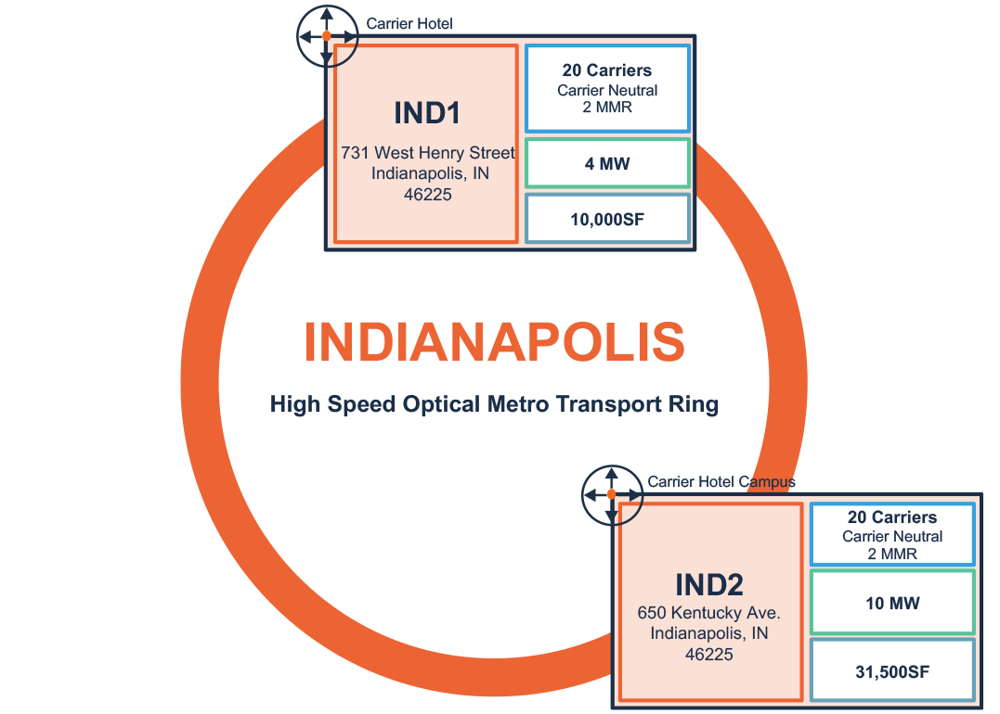
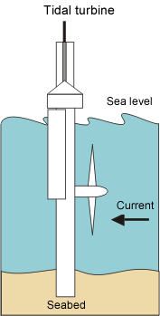
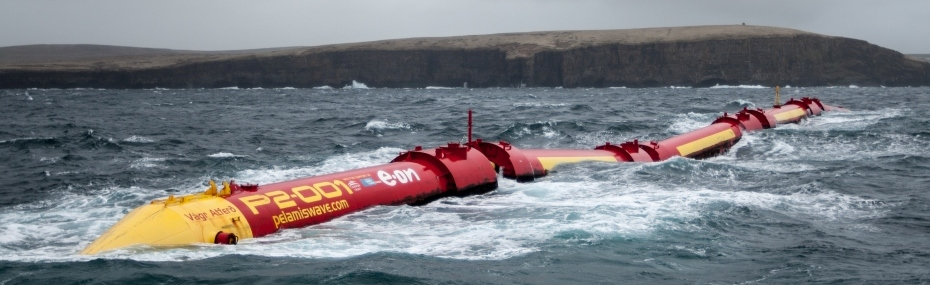
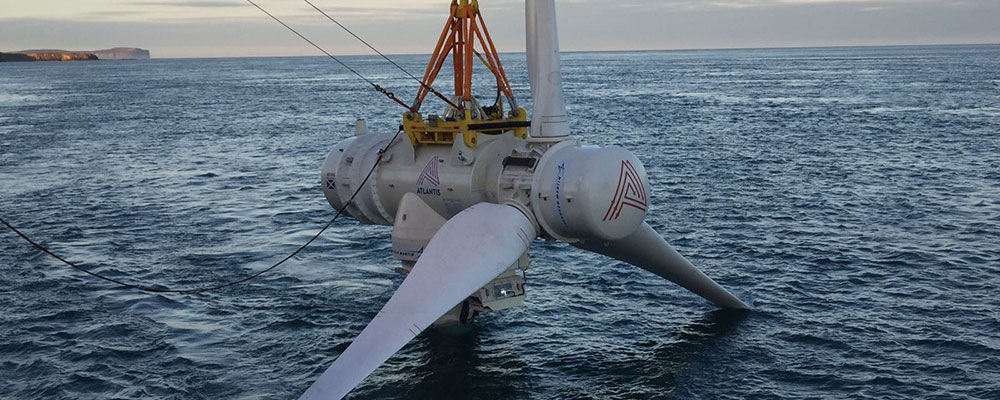

# Datacenter Xin Gu sp20-516-227

## E.Datacenter.2.b

### Indianapolis Data center

Indianapolis Data center locates in downtown Indianapolis, Indiana. The data center has been expanded and updated since 1994, and now there are two data carrier hotels, IND1 [@227IND1] and IND2 [@227IND2]. These two data center has 41,500 sq.ft facility area, 14 MW on-site power provided by A/B diesel power generators with N+1 design, and connectivity to 20 network providers. IND2 has 10 MW on-site power and 31,500 sq.ft dedicated facility areas. It features MotiveAir’s ChilledDoor solution, which could hold cabinet capacity up to 35KW. Both facilities are under 24*7*365 multilevel physical security service with staff and monitors.

{#fig:IND-Metro-Ring} 

The high speed optical metro transport ring between IND1 and IND2 was shown in @fig:IND-Metro-Ring. This metro fiber ring provide provide 1G to 100G capacity across IND1 and IND2 [@227metro-transport].

Take average cost $ 0.075 per kWh for running diesel generator, the yearly cost for energy is about 9 Millions.

## E.Datacenter.4

### Tidal Energy

Tidal energy is the energy converted from the tidal force created by sun-moon and earth rotation. Tidal energy could be extracted from the moving masses of water by tidal turbines. There are different tidal energy technology, including building tidal barrages, underwater tidal turbines, tidal fences [@227tidalenergy], and tidal snake [@227seasnake]. Tidal barrages are structures similar to a dam. Electricity can be generated when water goes in and out of the barrage by controlling the sluice gate. Underwater tidal turbines look like wind turbines but underwater, shown in @fig:tidalturbine. Tidal fences are aligned tidal turbines on a fence on the sea bed, and they generate energy when water passes the fence. Tidal snake [@227seasnake] generates electricity when floating on the surface of the sea, shown in @fig:sea-snake.

{#fig:tidalturbine}[@227tidalenergy]

{#fig:sea-snake} [@227seasnake]

The minimal difference in tidal is 10 feet to produce energy economically. Due to the expensive cost of the tidal energy facility and specific natural condition requirement, tidal energy is not widely used but in the stage of exploring and testing.   

SIMEC Atlantis Energy plans to launch a data center in 2024, and the data center will be powered by tidal energy in Scottish Highland [@227Scotland]. It is the first sea powered hyperscale data center in the world. MeyGen will be the source of energy for the data center, which is a tidal energy facility launched in 2010 by SIMC Atlantis. Currently, MeyGen has a power capacity of 6MW with the potential to scale up to 398MW [@227meygem].

The MeyGen is the world's largest and only commercial multi-turbine array project. @fig:oceanturbines shows the ocean turbine which will be installed on individual foundations under the sea with dedicated subsea cable array connected to ashore.

{#fig:oceanturbines}

## E.Datacenter.5

China

China is growing fast in installed renewable capacity. By 2018, China has a total capacity of 728 GW renewable power. In 2019, the installed hydropower, wind power, PV (Photovoltaics), and bio-mass power capacity are expected to grow 2.2%, 14.1, 14.9 and 23.6%, respectively[@227Chinarenewable].

China made up 34% of global investment for renewable energy, about $288.9 billion in 2018 which is about three times the United States' investment [@227UNEP]. With a large amount of investment, innovations and technology development are on a fast track, the renewable power market is expending quickly which greatly reduced the cost of renewable power technology.

Considering China's large demand for energy, coal is still the main source. By 2050, China expected to deduce coal consumption to 30%-50%. As the world's largest population, China is making a great effort in developing renewable energy which will help protect the environment and benefit for generations [@227niweidou_coal]. 

## E.Datacenter.8

Aug 22, 2013, Apple′s iCloud suffered an outage for about 12 hours, and about 11% of users (25 million people) had no access to iCloud services, including iCloud document, photo stream, apple pay and etc [@227Hockenson2013Aug]. The estimate cost of this outage is $2.4 million [@227cerin2013downtime].

